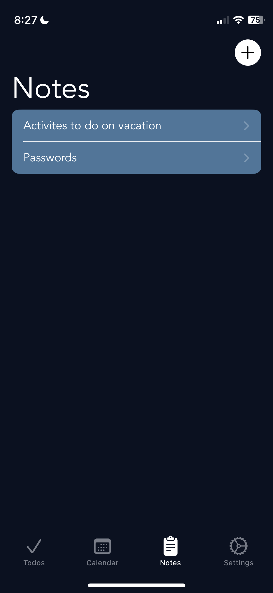
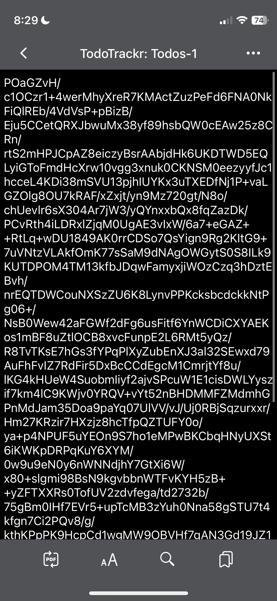

#  TodoTrackr

## Description

TodoTrackr is a comprehensive task management solution designed to streamline your productivity with essential features. It offers intuitive todo tracking, customizable task categories like "Courses" or "Work Projects," and seamless integration with a calendar for efficient scheduling. The app includes robust note-taking capabilities akin to popular apps, allowing for detailed project notes and idea capture. Security is ensured with 256-bit encryption using a user-determined salt, keeping your data safe. Whether for work, school, or personal use, TodoTrackr ensures you stay organized, focused, and productive with ease.

## Installation

Since this application is not available on the App Store, you will need to clone the repository and install the application using the `TodoTrackr.ipa` file. To download the app you will need a sideloading tool like [AltStore](https://altstore.io/).

## Screenshots

### Main View

  

### Add A Todo

  

### Edit A Todo

  

### Calendar

  

### Notes

  

### Note creation/editing

  

### Password needed to encrypt/decrypt the file

  

### Files encrypted with AES256

  

