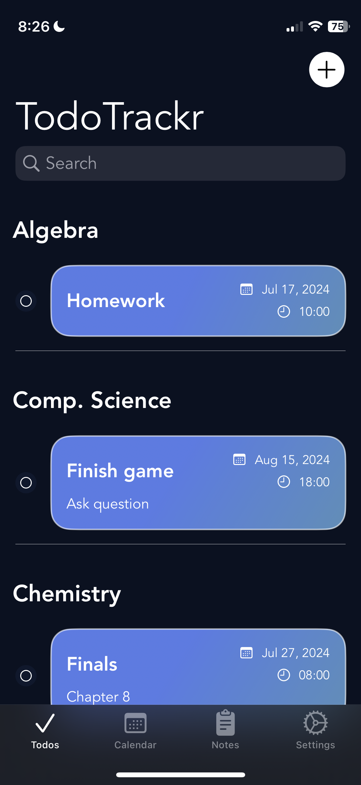
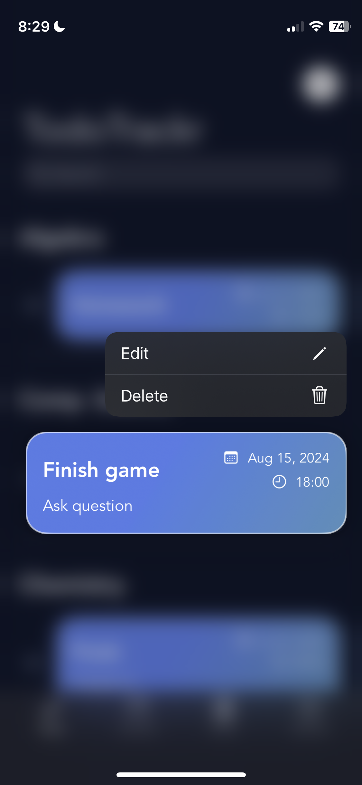

#  TodoTrackr

## Description

TodoTrackr is your go-to application for seamless task organization and management. With TodoTrackr, users can effortlessly create custom categories, such as "Courses," "Work Projects," or "Personal Errands," tailoring their task management experience to suit their unique needs.

Here's what sets TodoTrackr apart:

### Custom Categories

Users have the freedom to create personalized categories, allowing for intuitive organization of tasks based on different aspects of their lives or projects.

### Effortless Task Addition

Adding tasks to categories is a breeze. Whether it's jotting down a quick reminder or outlining a detailed to-do list, TodoTrackr ensures that users can capture tasks quickly and efficiently.

### CoreData Integration

TodoTrackr leverages CoreData for robust data management, ensuring the reliability and scalability of your task lists. CoreData's efficient data storage and retrieval mechanisms guarantee a seamless user experience, even with extensive task lists.

### JSON Export & Import

Need to share your task lists or back them up? TodoTrackr has you covered. With CoreData JSON encoding, users can export all app contents to a JSON file effortlessly. This feature ensures data portability and allows for easy integration with other applications or platforms.

## Screenshots

    

        
        
Main View

    

    

        
        
Add a Todo

    

    

        
        
Edit a Todo

    

    

        
        
Files in JSON format

    

